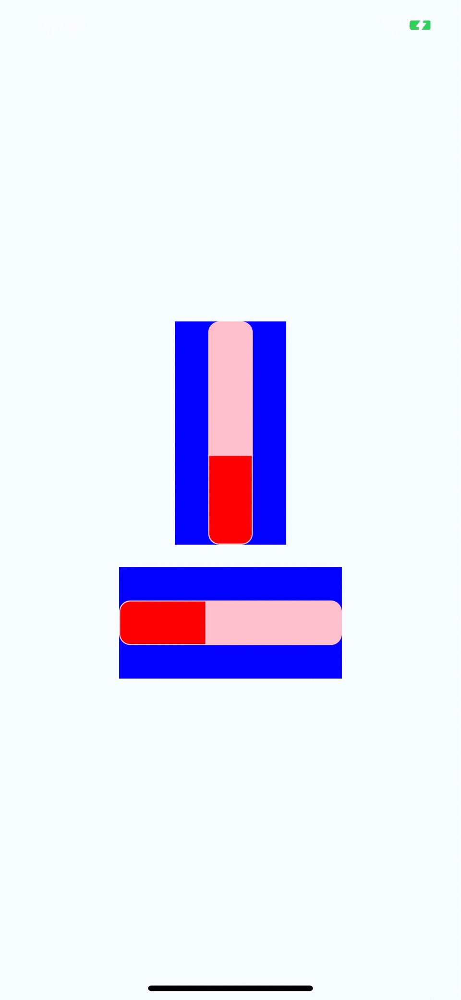

# react-native-cupertino-progress

A pure javascript ios13 progress component for react-native 

## Demo



## Getting started

`$ npm install react-native-cupertino-progress --save`


## Usage
```javascript
import CupertinoProgress from 'react-native-cupertino-progress';


export default class App extends Component {
  render() {
    return (
      <View style={{flex: 1, justifyContent: 'center', alignItems: 'center', backgroundColor: '#F5FCFF'}}>
        <View style={{ width: 100, height: 200, backgroundColor: 'blue', alignItems: 'center' }} >
          <CupertinoProgress onSlidingComplete={this._onSlidingComplete} onValueChange={this._onValueChange} progress={60} size={40} magnification={45} color='red' style={{ borderRadius: 20, backgroundColor: 'pink' }} />
        </View>
        <View style={{ width: 200, height: 100, backgroundColor: 'blue', marginTop: 20 }} >
          <CupertinoProgress onSlidingComplete={this._onSlidingComplete} onValueChange={this._onValueChange} horizontal={true} progress={60} size={40} magnification={45} color='red' style={{ borderRadius: 20, backgroundColor: 'pink' }} />
        </View>
      </View>
    );
  }
}

```


## Interface 

[Interface](./index.d.ts)